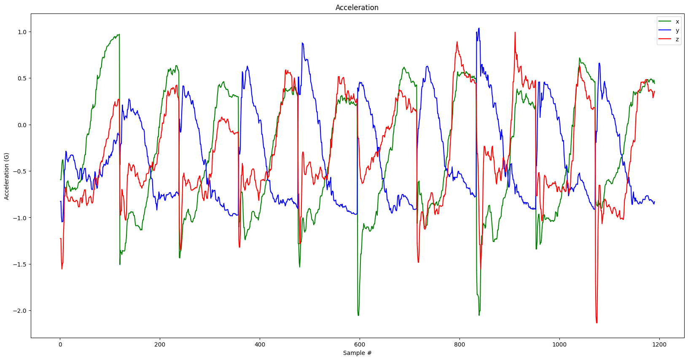
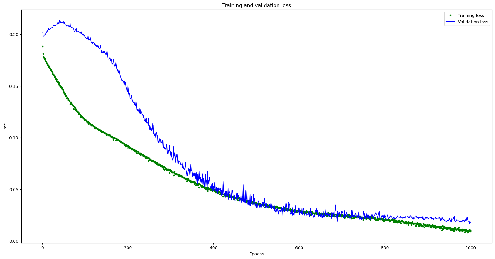

# Machine Learning on Meadow

## Dataset

The Dataset is an essential part of performing machine learning. There are two options for acquiring a dataset:
- Create your own dataset;
- Consume public and open datasets.

When creating your own data set, you must consider that the collection following a parameterization and a replication more closer to reality.

This project has available applications to assist in the data collection and a small dataset de gesture.

## Models

[TensorFlow Lite][1] allows you to use pre-trained models, modify or create your own. These models can perform tasks such as: voice recognition, video, pattern recognition, text, and more.

## Traning

Building a new model for TensorFlow requires training with the dataset, you can use a virtual machine in Colab or install the required tools to run local.

- The first step is the importance of the data and the separation between training and validation data.

Bellow shows the collected acceleration data.



- The second is neural network learning. This part it's where the weight is defined. After training we check some metrics sort as loss or accuracy. If your model learned moves to the last step, otherwise considered review previous steps.



- The third step converts the model to the format expected by TensorFlow Lite. The result expected is a large vector.

```
const unsigned char model[] = {
  0x1c, 0x00, 0x00, 0x00, 0x54, 0x46, 0x4c, 0x33, 0x14, 0x00, 0x20, 0x00,
  0x1c, 0x00, 0x18, 0x00, 0x14, 0x00, 0x10, 0x00, 0x0c, 0x00, 0x00, 0x00,
  0x08, 0x00, 0x04, 0x00, 0x14 ....
}
```

[1]: https://www.tensorflow.org/lite/models
